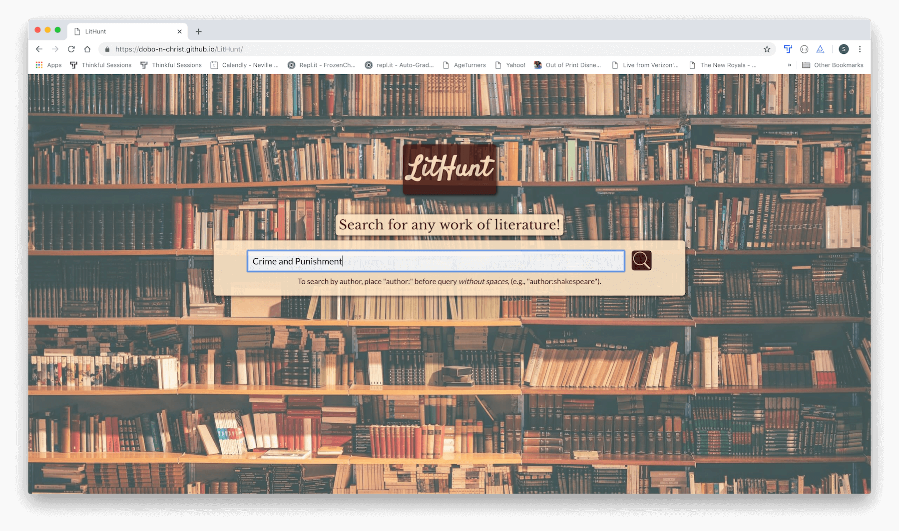
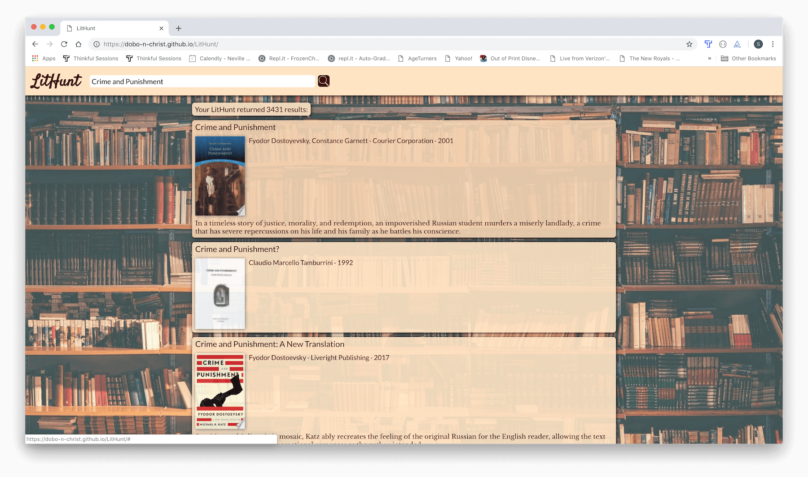
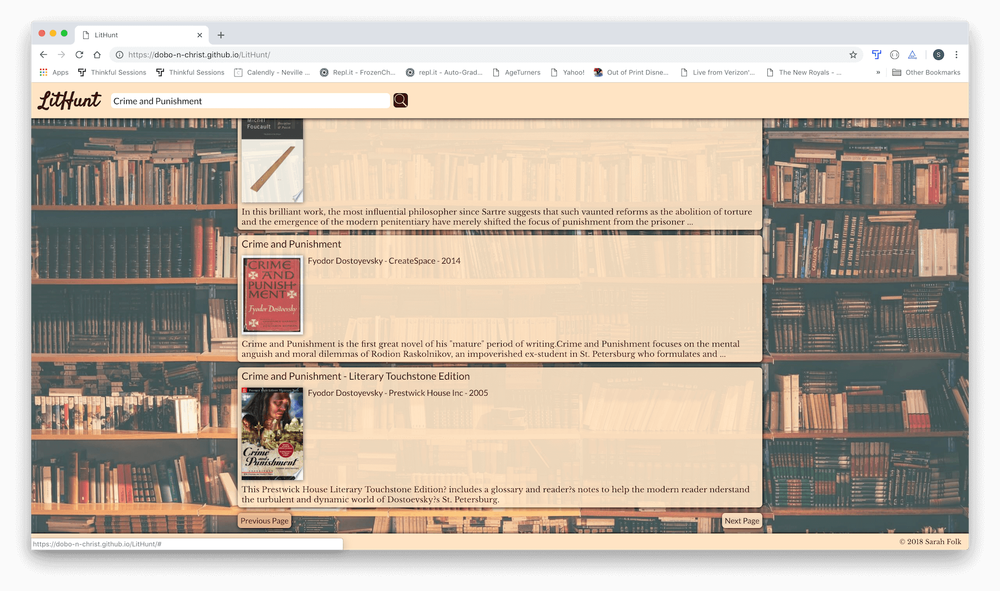
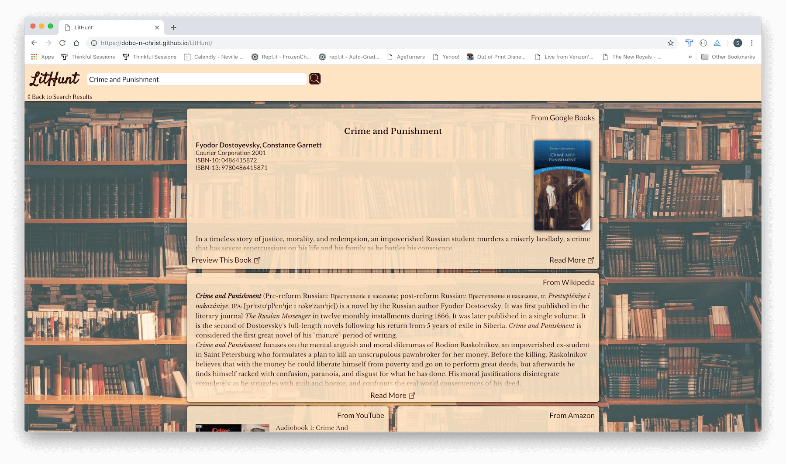
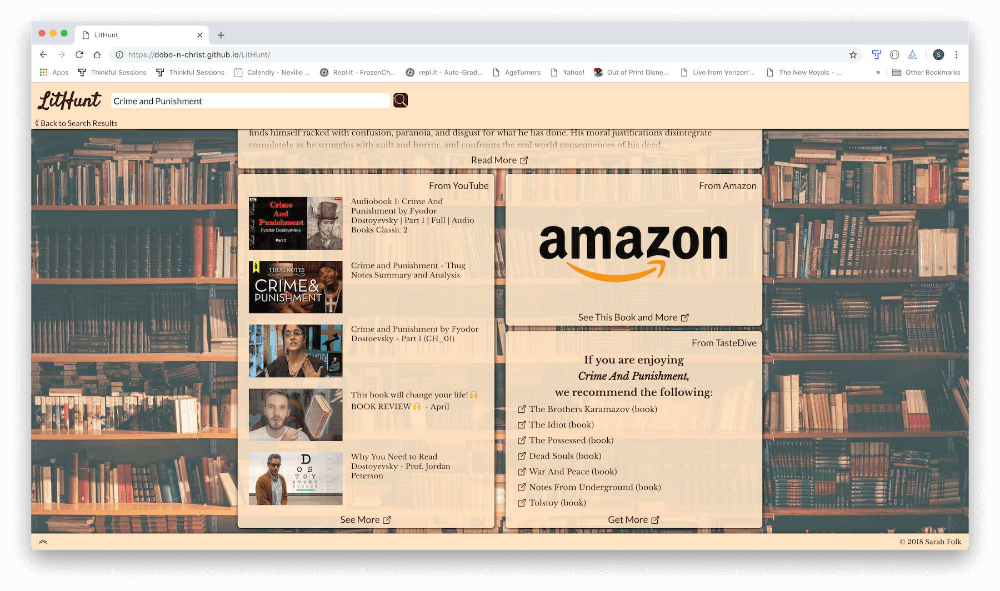

#LitHunt

[Live Link to LitHunt](https://dobo-n-christ.github.io/LitHunt/)

##Summary

LitHunt allows the user to search for a book, author, or other work of literature. It returns search results using the Google Books API. 

The user enters the search query on the home page (see first page photo below).

The user is presented with a list of search results (see second page photos below).

When a user clicks on a search result, the following occur (see third page photos below):

1. More detailed Google Books information is displayed 
2. A call to the Wikipedia API is made and information is displayed (if available)
3. A call to the YouTube API is made and information is displayed (if available)
4. An Amazon link to the product is provided
5. A call to the TasteDive API is made and information is displayed (if available)

##Photos of Website:
First Page

Second Page

Third Page

##Technology:

* HTML
* CSS
* JavaScript
* jQuery

##Thoughts on Future Improvements:

* More transition/animation effects